# Welcome! :bowtie: 

[Rocket.Chat](https://rocket.chat/) is a chat platform that enables you to connect with fellow entrepreneurs. It's useful for

* exchanging ideas :bulb:
* supporting each other in your business projects :briefcase:
* and discussing topics of common interest :iphone: :mortar_board: :satellite: :pill: :book: :factory: :taxi: :tractor: :egg: :necktie: :tropical_drink:

Why learn to use Rocket.Chat? 

* It's open source :unlock:
* It's free to use :free:
* It's gaining traction :chart_with_upwards_trend:

So it might be useful for communication among the team in the business that you're creating. :wink:

---

## :fast_forward: Key takeaways

1. You can use Rocket.Chat in a web browser or in a [Rocket.Chat app](https://rocket.chat/download) on a smartphone or computer.
1. [Public channels](#understanding-channels) are like a coffeeshop or a market: a public place to meet and discuss. [Private groups](#understanding-channels) are like a secret meeting with your closest advisors.
1. We suggest you [create your own public channel](#create-a-public-channel-for-your-business-project) to get feedback on your business idea. Put `p-` at the beginning of the channel name to mark it as a **p**roject. Give the channel a descriptive name such as `p-urban-farm`. [:pushpin: Pin](#pushpin-pinning-messages) your most important messages so that people can quickly understand your business project and help improve it.
1. Find other projects and try to help them with their business ideas. They may thank you with a token that could win you a prize! :money_with_wings:
1. Reward entrepreneurs who have given the most useful comments on your business idea by [giving them tokens](#tokens). 
1. Create public channels for general topics that you want to discuss with others, such as `#apps` and `#marketing`. Announce the channel to everyone in `#general`.
1. [Mention](#mention-someone-to-get-their-attention-wave) other users by writing `@name` to notify them. Use [emojis](#say-it-with-an-emoji-grin). :smiley: :sparkles: :tada:
1. Confused about using Rocket.Chat? Ask for help in the channel `#rocket-help` or look for answers in the [official Rocket.Chat documentation](https://rocket.chat/docs/user-guides/).

---

For the bare minimum to get started, you should [learn how to log in](#logging-into-rocketchat), [understand channels](#understanding-channels), and [create a public channel dedicated to your business idea](#get-feedback-on-your-business-idea).

## Logging into Rocket.Chat

You can access Rocket.Chat through an app or in any web browser (Chrome, Firefox, Safari, etc.).

### Rocket.Chat app :iphone: :computer: :rocket: :stars: 

We recommend you use a Rocket.Chat app on your phone or computer, so that it's easy to access it and to get notifications. To get started:

1. [:arrow_down: Download Rocket.Chat](https://rocket.chat/download) on as many devices as you want (Android, iOS, Mac, Windows, Linux).
2. Open the app and **enter the server name** that we sent to you via email. The server name looks like `server-name.rocket.chat` but with `server-name` replaced by a word; look for that word in the email we sent you. Press <kbd>CONNECT</kbd>.
3. Enter the **username and password** that were sent to you in an email, and press <kbd>LOGIN</kbd>. 

You should now be logged into Rocket.Chat. Nice work! :thumbsup: Skip ahead to [add a profile picture](#add-a-profile-picture-man_with_turban-older_woman-japanese_ogre).

### Rocket.Chat through a web browser 

To access Rocket.Chat through any web browser (such as Chrome, Firefox, or Safari):

1. Open in a web browser the URL that we sent to you via email. The URL will look like `https://example.rocket.chat` but with `example` replaced by another word; look for that word in the email sent to you.
2. Enter the **username and password** that were sent to you in an email, and click on <kbd>LOGIN</kbd>. 


### Add a profile picture :man_with_turban: :older_woman: :japanese_ogre:

We suggest you add a profile picture so that others can associate a face (or a business logo) to your name. Here's how:

- First open the settings:
	- :iphone: On the mobile app, tap on the  in the top-left corner to open the main menu. Tap on your name on the top; it looks like 
	- :computer: On a desktop app or browser, click on your name in the top-left corner; it looks like 
- Click on on , then click on `Avatar`.
- To upload a picture, click on `Select file` and choose a picture from your phone or computer. 

Now you should see your :grinning: in the top-left corner, like this:  :grin: :tada: 

If you don’t upload a photo, your avatar will be your initials. That's OK too. :smile:

## Understanding channels

Nice work logging into Rocket.Chat :clap: Now let's chat! :speech_balloon:

Conversations in Rocket.Chat are organized into **channels**. Channels are chat rooms with many useful features. There are three kinds of channels: 

### 1. **Public channels** are open spaces for discussion

Think of a conversation in a public channel as a conversation you would have at a market, city square, or cafe. Everyone is free to join the conversation. Specifically, everyone can 

*  **see** all public channels;
* **preview** the contents of all public channels;
* **join** any public channel.

### 2. **Private Groups** are closed channels

Think of it as your secret place to talk with close confidants :smirk: Only the members of a private group know that it exists and can see its contents. The person who creates a private group is the **owner**. The owner can 

* :envelope: invite people to join the private group; and
* :boot::arrow_heading_up: kick people out of it.

### 3. **Direct Messages** are private, 1-on-1 conversations

Think of a Direct Message as a private group with only two members: it is a secret conversation between you and one other person.


### How to see the list of channels that you belong to

The list of channels is on the left-side. On a small screen (such as a :iphone:) you may need to tap on the  in the top-left corner to see the menu and list of channels. Like this:

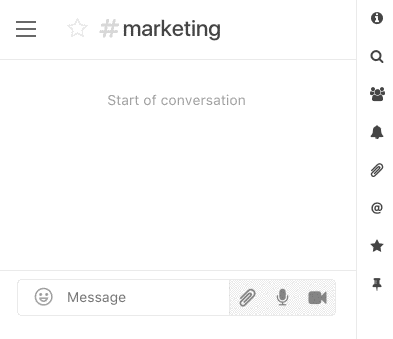

Public channels have a `#` next to them. Private groups are marked by a :lock:. Direct messages appear in a separate list below the others.

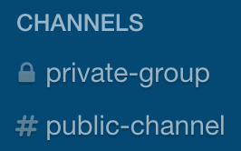


### Each channel has a list of **members**

Everyone is a member of the `#general` channel. Other channels typically have fewer people in them.

To see who is a member of a channel that you are currently viewing, tap on the  icon on the right-hand side. The list of members has green dots next to everyone who is on Rocket.Chat at that moment:

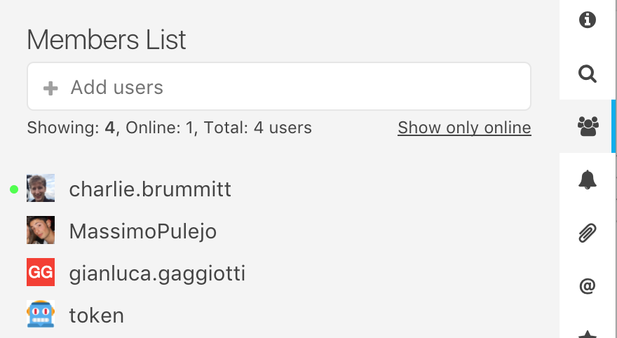


## Get feedback on your business idea

### :bangbang: Everyone should create a public channel dedicated to their business proposal

This channel lets you share your business ideas with fellow entrepreneurs and get feedback from them. They may give you useful ideas :bulb::bulb::bulb: 

To create your own public channel:

1. First [open the list of channels](#how-to-see-the-list-of-channels-that-you-belong-to). (On a small screen, you must tap on the  to bring up the menu on the left.)
1. Click on the  next to the search box: 
1. **Choose a channel name** that begins with `p-` so that it is easy to identify channels dedicated to **p**rojects. The rest of the channel's name should describe your business idea, with words separated by hyphens `-` or by underscores `_`. For example: `p-urban-farm` or `p-taxi_app` or `p-reusable_rocket_for_space_tourism`.
1. When you are done, press 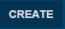. Now your project channel is ready! :tada: 

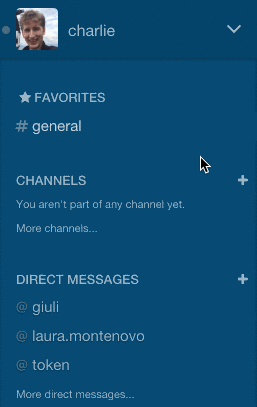

### Write about your business idea in your project channel

We suggest you **write a brief summary of your business idea in your project channel** so that others can give you feedback. This community of entrepreneurs is a great opportunity to get advice and ideas. :bulb::bulb::sparkles:

* First, open your channel (such as `#p-urban-farm`) by clicking on it in the blue menu on the left.
* Write a message that briefly summarizes your business idea. You can copy and paste what you wrote for module 0 of the course. Or share whatever you are comfortable sharing.
* Highlight what aspects of your business you would like suggestions on (such as the suppliers, or the marketing strategy).

#### :pushpin: Pinning messages
When someone first looks at your project channel, what should they read? We recommend that you **pin the most important messages in your project channel**, such as:

- summaries of parts of your business proposal;
- questions that you have that others may help you with.

When people join your project channel, they can easily understand your project by reading the pinned messages without having to scroll through the entire message history :relieved:.

To pin a message:

| on a smartphone :iphone: | on a computer :computer: |
| --- | --- |
| 1. press and hold on a message to open a menu | 1. hover your mouse over a message and click on the  icon next to the message |
| 2. press "Pin Message" | 2. click on the pin icon  |

Everyone can see the pinned messages of a channel by clicking on the  icon in the tool bar on the right.  


### Announce your channel 

Now that your project channel has a description of your business idea, let's announce it to the community. Write a message in the public channel `#general`. (Remember, everyone is [a member of](#each-channel-has-a-list-of-members) `#general`.) Refer to your project channel with a `#` at the beginning (such as `#p-urban-farm`) so that a link to your channel is automatically created, and people can click on `#p-urban-farm` to open your channel. Like this:

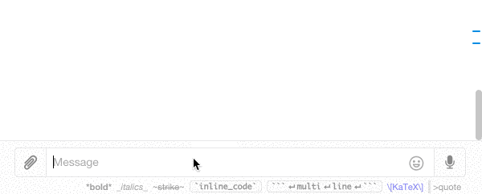

By the way, use `#general` to send all kinds of announcements: about new channels you've created, ideas you want to discuss, or expertise you're searching for. If you want to discuss a certain topic such as `#apps` or `#internet-of-things`, **create a separate public channel for it**, and announce your new channel in `#general`.

#### Invite people to your channel

You can invite a single person to your channel. For example, to invite `@barack.obama` to your project channel `#p-reusable_rockets_for_space_tourism`, write

```
/invite @barack.obama
``` 
in your channel `#p-reusable_rockets_for_space_tourism`. Now that Mr. Obama is in your channel you can ask for advice:
> Yo @barack.obama! What do you think of the go-to-market strategy for my space tourism business? Please see the message I wrote above. :point_up: Thanks!

Perhaps `@barack.obama` will have a crucial idea for improving that go-to-market strategy :bulb::bulb::sparkles:

#### Invite everyone from another channel

You can also invite to your channel _everyone_ who is a member of some other channel. For example, to invite everyone in the `#general` channel to your project channel `#p-reusable_rockets_for_space_tourism` (because _everyone_ has opinions on the space trip of their dreams), write

```
/invite-all-from #general
```

in your project channel. Like this: 

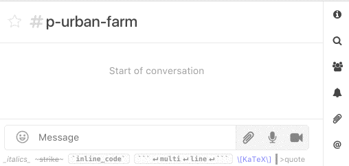

:boom: Now everyone is a member of your channel and is ready to give you feedback about your business idea. :speech_balloon: :grinning:

### Making your project discussion private

We recommend that you keep your project channel **public**: your ideas should reach as many fellow entrepreneurs as possible. But you are free to make your channels private. To continue discussion in a private group, you can either

1. **create a new channel that is private** by turning on the switch labeled `Private` when you create the channel:

	

2. or **convert a public channel to a private group**. To do so, open the channel and click on the 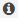 icon in the top-right corner. Now turn on the `Private` setting.


## Giving feedback to other people on their business ideas

So far, you've learned to [see the list of channels you belong to](#how-to-see-the-list-of-channels-that-you-belong-to), to [create your own channel](#bangbang-everyone-should-create-a-public-channel-dedicated-to-their-business-proposal), and to [invite others to it](#invite-people-to-your-channel). Now we'll learn to give feedback to others. Giving feedback is rewarding in itself. The people you help may also [thank you with tokens](#tokens) that could win you a trip to Milan (these "tokens" are [explained more below](#tokens)).

### Joining a channel

When you [look at the list of channels on the left-hand side](#how-to-see-the-list-of-channels-that-you-belong-to), you only see the channels you are a [member of](#how-to-see-the-list-of-channels-that-you-belong-to). There may be other channels that you do not yet know about. To browse channels you are not a member of: 

- click on the  button in the left-hand pane (where you [see the list of channels you belong to](#how-to-see-the-list-of-channels-that-you-belong-to));
- click on the name of a channel to preview its discussion;
- if you find an interesting channel, join it by clicking on the  button.

### :star: Favorite channels

You may join a lot of channels. To organize them, we recommend you **favorite** (or **star**) channels, private groups, and DMs. 

To favorite a channel, click on the star icon in the upper left hand corner of the message area (next to the room name). It looks like this:   Then the star becomes yellow:  Nice, now the channel conveniently appear under the list of **Favorites** in the left-hand pane:

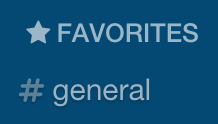

### Hiding and leaving channels

You may realize after joining a channel that you are no longer interested in it. Don't worry; it's easy to leave a channel. There are two ways to exit:

| action | meaning | how to do it on a smartphone :iphone: | how to do it on a computer :computer: |
| --- | --- | --- | --- |
| **hide** a channel  | remove it from your list, but remain a member of the channel  | tap on the  in the top-left corner to see the list of open channels, hold down on the channel name to bring up the buttons, and click on the  button | hover your mouse over the channel in the list of channels on the left-hand side, and click on  |
| **leave** a channel  | remove it from your list and remove yourself as a member | enter the message `/leave` or `/part` in the channel | hover your mouse over the channel in the list of channels on the left-hand side, and click on  |


## Messaging :page_with_curl:

Type messages in the message box and press <kbd>&#x23ce;</kbd> (<kbd>Enter</kbd>) or the send button . If you want to send multiple lines of text, press <kbd>&#x21E7;</kbd> <kbd>&#x23ce;</kbd> (<kbd>Shift</kbd> <kbd>Enter</kbd>) to move to the next line.

### Mention `@someone` to get their attention :wave:

To get someone’s attention, type `@` followed by their username, for example `@Barack.Obama`. (Rocket.Chat automatically completes someone's username as you type it.) Then your friend `@Barack.Obama` will see a red badge on the channel and will be notified via email or his mobile device.
 
To notify everyone in a channel, write `@all`. But remember, `@all`  notifies _everyone_! It can be useful for important announcements. But it can be distracting if abused, so use `@all` sparingly.

### Referring to previous messages :point_up_2:

To refer to a previous message in a conversation, you can grab a link to a certain message:

- :computer: On the desktop app, hover the mouse over a message, click on the gear icon , and click on the link 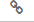. 
- :iphone: On the mobile app, press and hold on a message, click on `Permalink`. 

This copies to your clipboard a link to that message. Paste that link into a new message to create a clickable link and a preview to the old message.

### Say it with an emoji! :grin:

To insert emoji in a message, hit the emoji button  to the right of the text input to open an emoji picker:

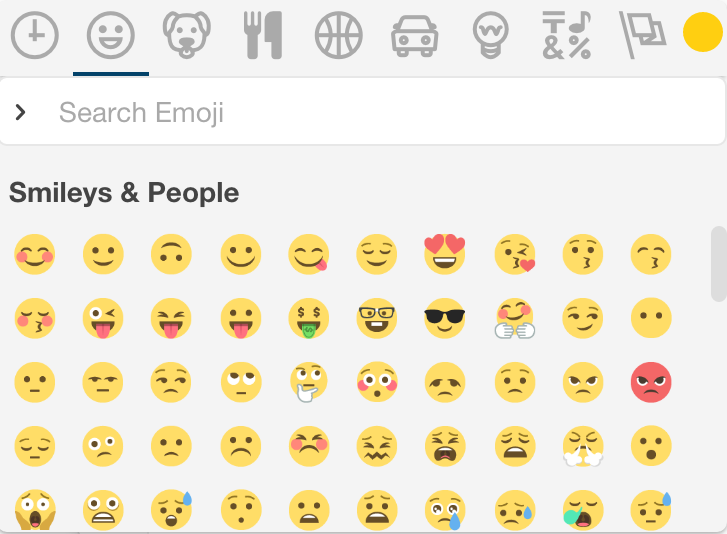

You can also type your desired emoji by wrapping its name with `:`. For example, `:heart:` produces :heart:.

### Emoji reactions

You can also _react_ to a message with an emoji. 

 - On the **desktop** application: hover over a message, click on the gear icon , click on the smiling face icon

	
	
 - On the **mobile** application: press and hold your finger on a message to bring up a menu, press `Reactions`

Then choose an emoji from the emoji picker, and the emoji appears below the message: 


To remove an emoji reaction, click on the emoji below the message. To add to an existing emoji reaction that someone else already posted, click on that emoji to add to that emoji's counter.

## Tokens

:bangbang: **To acknowledge other entrepreneurs for their ideas and contributions, thank them by giving them a _token_.** 

Giving a token to someone is a way to say

> Thank you, you have really helped me with my business plan. Let's keep this conversation going!

At the end of the contest, venture capitalists and other investors will evaluate business plans. They will also decide which ones they want to fund. **If you hold a token given by someone whose business plan was highly rated by the investors, then that token is a lottery ticket :ticket: for a prize:** 

- :airplane: :school: :briefcase: :city_sunrise: The prize is an all-expenses-paid trip to Milan :it: for a business training course and #startup week at the [Business School of Bocconi University](http://www.sdabocconi.it/en), one of the best business schools in Europe. The cost of this intensive course, lodging, and travel will be fully covered. There will also be an opportunity to pitch to investors in Milan. 
- There will be 50 such prizes!
- **The more you help others with their projects, the more tokens you will be given, and the more chances you have at winning one of these 50 trips to Milan.**

### Giving tokens

Everyone gets **7 tokens** every Sunday at midnight. You have 7 days to give out those tokens before they disappear.

To track the transfer tokens, we created a "bot" named `@token`. This bot is a robot 🤖 who is a member of your team. This bot responds to certain commands. You can talk to `@token` in a direct message or in any public channel.
 
To give a token to `@someone`, send the message

```
/give @barack.obama
```

in any public channel or in a direct message to `@token`. (Replace `barack.obama` with the username of the person you want to thank.) Here is an example:

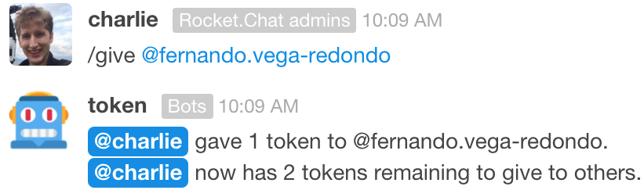

Notice that the bot `@token` responds by confirming that a token was successfully given to `@fernando.vega-redondo`. `@token` also reports how many tokens `@charlie` has left to give before they disappear the next Sunday at midnight. 

To thank someone for significantly helping your business plan, you can give them _multiple tokens_. You can do so using multiple `/give @username` commands. Or you can send multiple tokens all at once by writing `/give 3 @someone` or `/give all @someone`, like this:

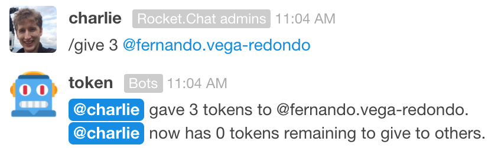

#### Remember: 

* You get **7 tokens every Sunday at midnight** :first_quarter_moon_with_face:
* If you don't use some tokens by the following Sunday, **they disappear**, so be sure to give tokens to thank people who have helped your business plan.

#### Practice giving a token

**Try giving a token to the** `@token` **bot!** Don't worry, the bot won't actually transfer one of your tokens. This is just for practice. :relaxed: 

First, open a direct message with the token bot. To do this, type "token" in the search bar in the top-left corner (it looks like this: ), and then click on `@token`.

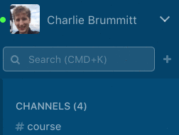

Now you can send messages directly to `@token`. Send the message `/give @token` to practice giving a token to the `@token` bot. You should get a reply from the bot telling you that it received your command:

 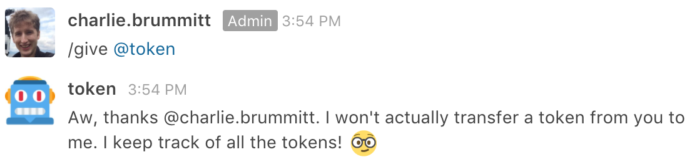


### _Who has been thanked the most?_

To find out, send the message 
```/leaderboard
```
in a public channel or in a direct message with the `@token` bot. Then the `@token` bot responds to you in a direct message:

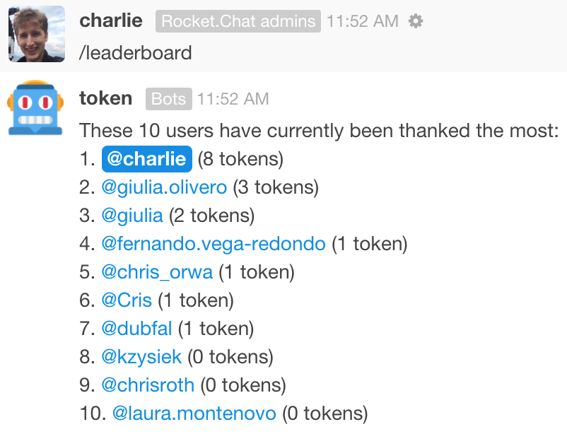

In this example, `@charlie` has been thanked the most: 8 people have given him a token so far. Nice work!

### _How many tokens do I have left to give?_

To find out, send the message 

```
/status
```

in a public channel or in a direct message to the `@token` bot. Then the bot sends you a direct message that summarizes the number of tokens you have left to give, whom you have thanked with tokens, and who has thanked you with tokens.

Here is an example:

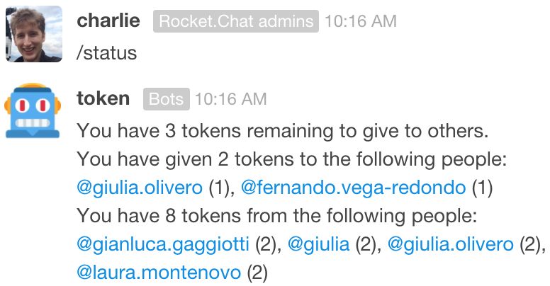

### Learn more about interacting with the `@token` bot

More details on how to send, receive, and check the status of tokens is available in [this token-bot user guide](https://github.com/cbrummitt/token-allowance-bot/wiki/@token-bot-cheat-sheet).

## Advanced Rocket.Chat skills

### :mag: Search messages

Rocket.Chat allows you to search within channels for messages that you want to see again. To do so, just click on the **search icon** 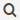 in the vertical toolbar on the right. In the search bar, type one or more keywords included in the chat message that you want to find. 

### Set the topic of a channel

In addition to 

- choosing a [descriptive name for your project's channel](#get-feedback-on-your-business-idea) and
- [pinning important messages](#pushpin-pinning-messages) that summarize your project

you can help users understand your project by setting a **topic** for your project channel. A topic is a small amount of text that appears in small, gray font next to your channel name: 


Keep the topic short because not much can fit next to the channel name. To assign a topic to your channel, you can either

1. write the command `/topic growing vegetables on rooftops`;
2. or click on the information icon  and click on the pencil button  under **Topic**.

### :pencil2: Editing messages 

You can edit a message in Rocket.Chat after you have sent it. 

-  :iphone: On the mobile app, press and hold on a message to bring up the menu, and click on `Edit`. 
-  :computer: On the desktop app, click on the gear icon  next to the message, and then click on the pencil icon . Alternatively, hit the <kbd>Up Arrow</kbd> in the message input box.

Then the message box has a yellow background, meaning that you can edit the message. Then hit the send button . Now  appears next to that message.

You can also **delete** a message: 

-  :iphone: On the mobile app, press and hold on a message to bring up the menu, and click on `Delete`. 
-  :computer: On the desktop app, click on the gear icon  next to the message, and then click on the trash icon .

Another way to delete a message is to edit the message to have no content.


### Online, Away, Busy, and Invisible

At the top of the main menu, you see your username. If you click on it, then you can change your status between Online, Away, Busy, and Invisible:

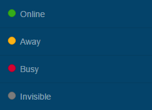

If you choose "Invisible", then others will think that you are not online. But we don't recommend you be an invisible ghost :ghost:!

## Passwords and logging in

### :worried: Help, I can't log in to Rocket.Chat!

There are a few common reasons for being unable to log in: 

1. **Forgotten password**: If you are unable to log into Rocket.Chat, first try resetting your password. The login screen has a button <kbd> Forgot your password </kbd>.  
1. **Updating files takes a long time**. Rocket.Chat is being improved every week, so the app periodically asks you to update the software. If it takes a long time to update files, try quitting the app and opening it again. You could try skipping the update and wait to update the app until you are connected to wifi.
1. **Wrong server**: You may be trying to log into the wrong server. A Rocket.Chat server looks like `server-name.rocket.chat`, where `server-name` is replaced by the name of your server. (A Rocket.Chat server may also have `https://` in the beginning.) Your server name was sent to you in an email. The next section explains how to change the server you are trying to log into.

If you are still having trouble logging in, send [an email to Charlie](mailto:charles_brummitt@hms.harvard.edu).

#### Switching servers
If you belong to multiple servers on Rocket.Chat (such as `demo.rocket.chat` and one for the Adansonia Project), you can easily switch among them. 

- :computer: On the desktop app, the servers are listed on the far left-hand side. You can switch between servers by pressing <kbd>&#8984; Command</kbd> followed by a number.

	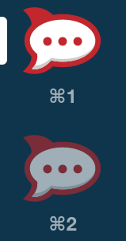

- :iphone: On the mobile app, at the login screen where you enter your user name and password, **swipe up with two fingers** to bring up a screen at which you select the server: 

	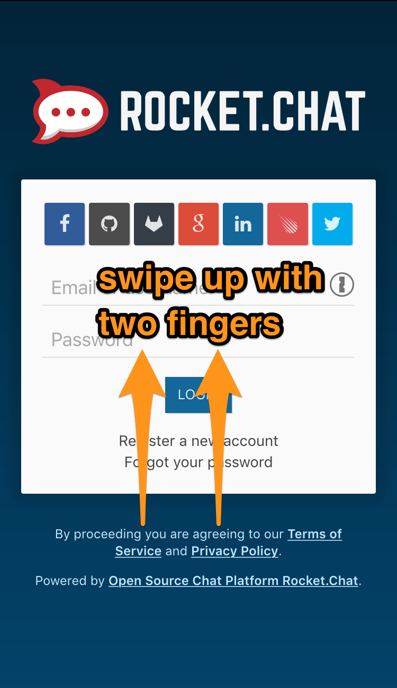
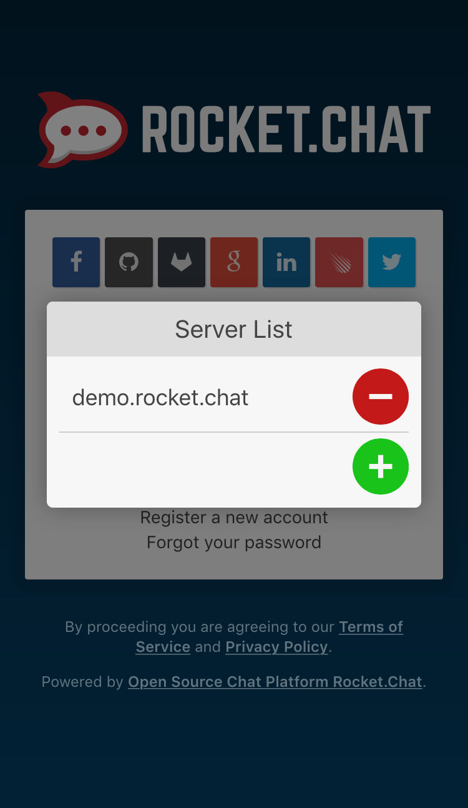


### :lock: Change your password

If you ever want to change your password, do the following:

- Open the main menu. 
	- :iphone: On the mobile app, tap on the  in the top-left corner to open the main menu
	- :computer: On the desktop app, make sure the window is large enough to see the list of channels on the left side; otherwise, click on the  in the top-left corner.
- Click on your username
- Click on 
- Click on `Profile`


## Learn more at the [Rocket.Chat documentation](https://rocket.chat/docs/user-guides/)

- [Keyboard shortcuts](https://rocket.chat/docs/user-guides/keyboard-shortcuts/)
- [Setup desktop and push notifications](https://rocket.chat/docs/user-guides/notifications/)
- [Upload files](https://rocket.chat/docs/user-guides/file-uploads/)
